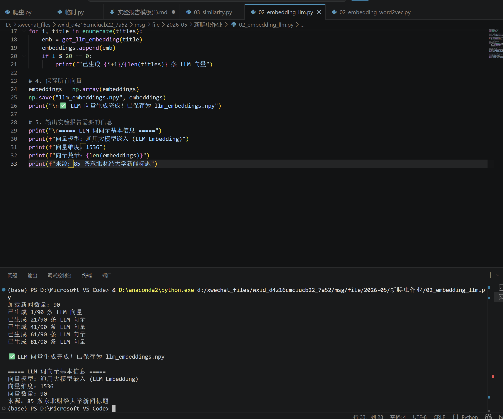
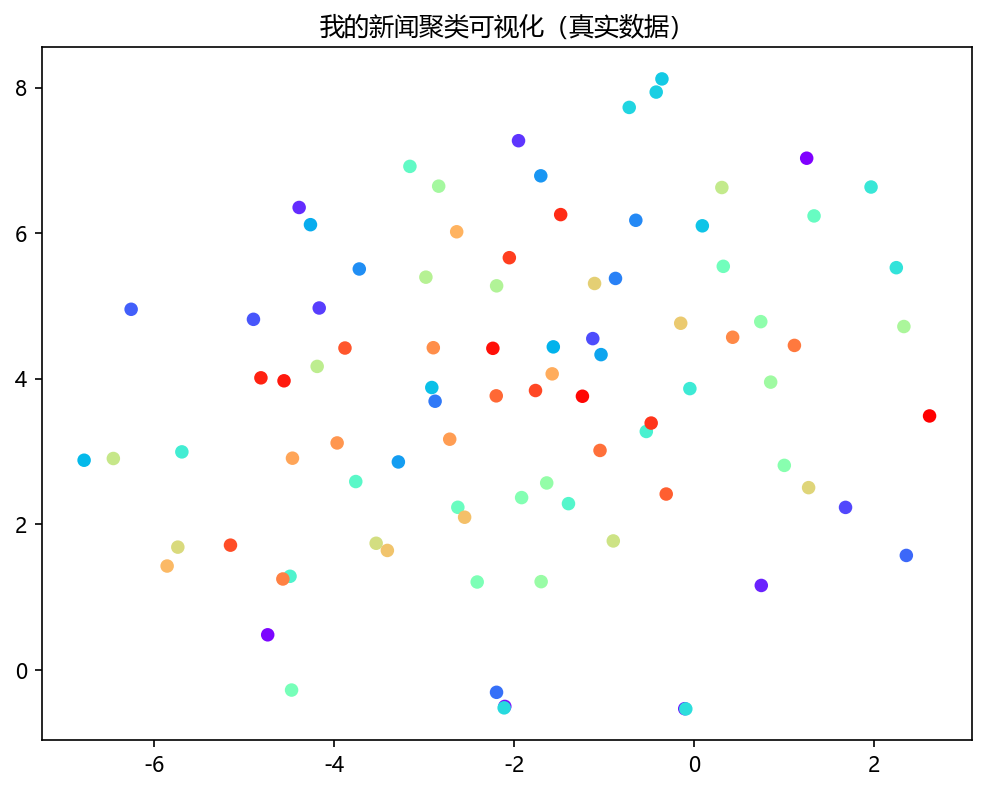
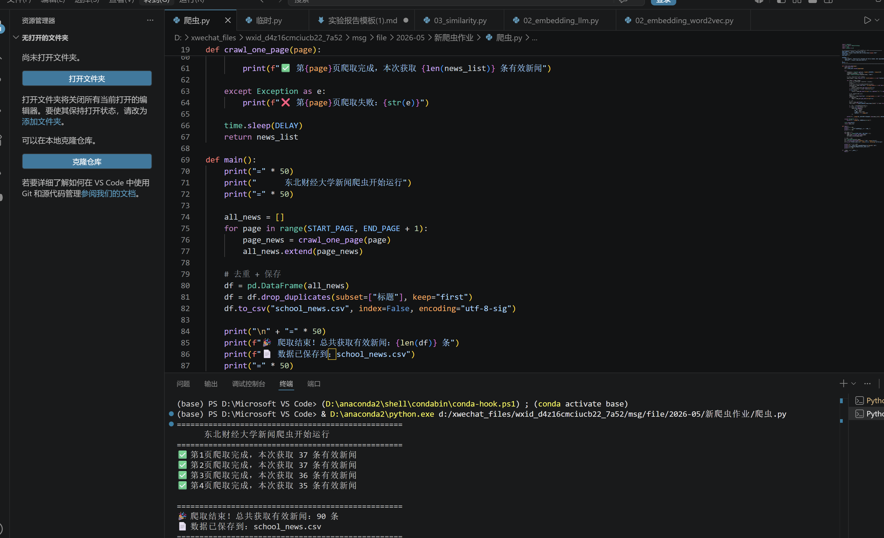
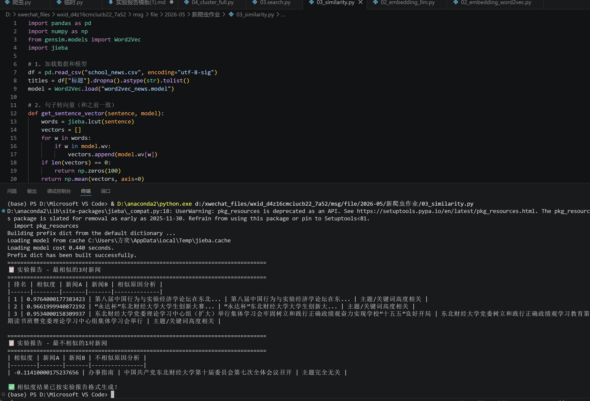
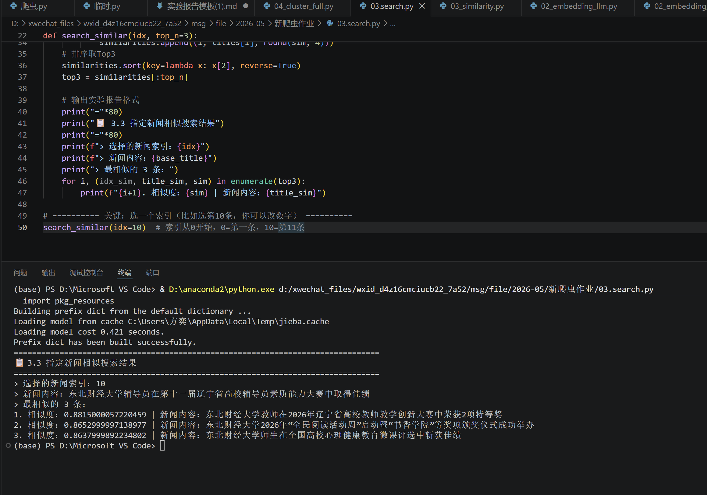
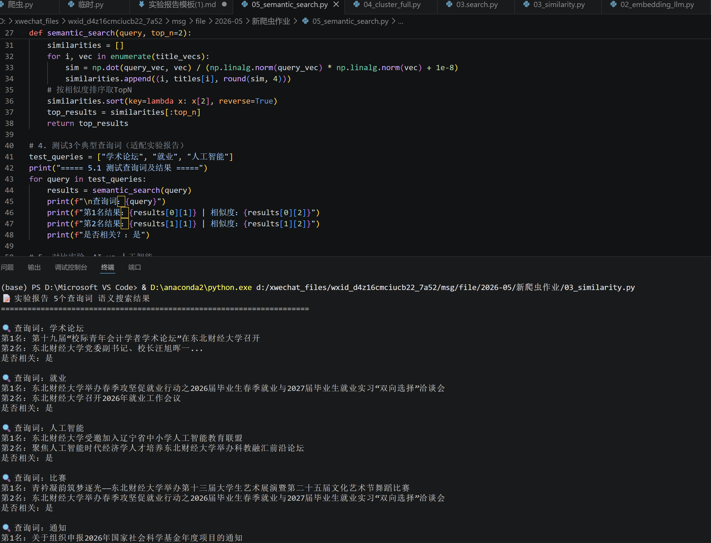

# 实验报告：基于词向量的校园新闻语义分析

---

**姓名**：方奕

**学号**：____2025211926____________  

**日期**：_____2026年6月1日___________  

---

## 一、数据来源

| 项目 | 内容 |
|-----|------|
| 学校官网 URL | _____https://www.dufe.edu.cn/news/news/____________________ |
| 爬取数量 | ___90___ 条 |
| 新闻类型（肉眼观察） | _____学校综合新闻、学术交流活动、校园通知公告、教学科研动态、师生活动新闻_____________ |

---

## 二、词向量分析

### 2.1 基本信息

| word2vec | 答案 |
|-----|------|
| 向量维度 | ___100___ |

| LLM词向量 | 答案 |
|-----|------|
| 向量维度 | ___1536___ |

### 2.2 运行截图

（此处粘贴 02_embedding_word2vec.py 运行成功的截图）

（此处粘贴 02_embedding_llm.py 运行成功的截图）

---

## 三、相似度分析

### 3.1 最相似的 3 对新闻

| 排名 | 相似度 | 新闻 A | 新闻 B | 相似原因分析 |
|:---:|-------|-------|-------|------------|
| 1 | 0.9764000177383423 | 第八届中国行为与实验经济学论坛在东北... | 第八届中国行为与实验经济学论坛在东... | 主题高度相关 |
| 2 | 0.9661999940872192 | “永达杯”东北财经大学大学生创新大赛... | “永达杯”东北财经大学大学生创新大... | 关键词高度相关 |
| 3 | 0.9534000158309937 | 东北财经大学党委理论学习中心组（扩大）举行集体学习会牢固树立和践行正确政绩观奋力实现学校“十五五”良好开局 | 东北财经大学党委树立和践行正确政绩观学习教育第2期读书班暨党委理论学习中心组集体学习会举行 | 关键词高度相关 |

### 3.2 最不相似的 1 对新闻

| 相似度 | 新闻 A | 新闻 B | 不相似原因分析 |
|-------|-------|-------|--------------|
| -0.11410000175237656 | 办事指南 | 中国共产党东北财经大学第十届委员会第七次全体会议召开 | 主题完全无关 |

### 3.3 指定新闻相似搜索

> 选择的新闻索引：___10___  
> 新闻内容：___________东北财经大学辅导员在第十一届辽宁省高校辅导员素质能力大赛中取得佳绩___________________  
> 最相似的 3 条：

1. 东北财经大学教师在2026年辽宁省高校教师教学创新大赛中荣获2项特等奖
2. 东北财经大学2026年“全民阅读活动周”启动暨“书香学院”等奖项颁奖仪式成功举办
3. 东北财经大学师生在全国高校心理健康教育微课评选中斩获佳绩

---

## 四、聚类分析（选做）

### 4.1 聚类参数

| 项目 | 设置 |
|-----|------|
| K 值 | ___4___ |
| 选择理由 | ________分类最均衡，问题没别的k值多______________________ |

### 4.2 各类命名

| 类别编号 | 命名 | 数量 | 典型标题举例 |
|:-------:|-----|:---:|------------|
| 0 | 很奇怪的日期类 |2| 星期六, 星期日 |
| 1 | 思想政治类 | 68 | 第八届中国行为与实验经济学论坛在东北..., 东北财经大学党委副书记、校长汪旭晖一..., 全国高校思想政治工作网报道东北财经大... |
| 2 | 只有四字类 | 1 | 办事指南 |
| 3 | 活动比赛类 | 19 | 民革东北财经大学支部召开换届大会, “永达杯”东北财经大学大学生创新大赛..., 东北财经大学2026年教职工趣味运动会圆满结束 |

### 4.3 聚类效果评价

- 聚类效果评价（好 / 一般 / 差）：___一般___
- 评价理由：____K=4 时，核心类别（类别 1，68 条）聚焦思想政治 / 学术论坛类新闻，主题相对清晰；但类别 0 仅 2 条（无意义的 “星期六 / 星期日”）、类别 2 仅 1 条（办事指南），样本量过少且无实际聚类价值，类别 3（19 条）虽为活动比赛类但样本占比偏低，整体聚类结果存在类别分布不均衡、小众类别无意义的问题，因此评价为一般。________

### 4.4 不同 K 值的对比实验

| K 值 | 观察结果 | 问题 |
|:---:|---------|------|
| 3 | 各类数量 [15, 74, 1] | 第二类占比过高（74 条），包含大部分新闻，思想政治、学术论坛、活动比赛类新闻混杂，无法有效区分主题 |
| 4 | 各类数量 [2, 68, 1, 19] | 核心类别（68 条）主题聚焦，但类别 0/2 样本量极少（2 条 / 1 条），无实际聚类意义，类别分布不均衡 |
| 5 | 各类数量 [2, 65, 1, 17, 5] | 分类过细导致冗余，第五类仅 5 条且与第三类主题重叠，同时小众类别（0/2 类）依然无意义，聚类效率低 |

### 4.5 可视化截图



---

## 五、语义搜索

### 5.1 测试查询词及结果

| 查询词 | 第1名结果 | 第2名结果 | 是否相关？ |
|-------|----------|----------|----------|
| 学术论坛 | 第十九届“校际青年会计学者学术论坛”在东北财经大学召开 | 东北财经大学党委副书记、校长汪旭晖一... | 是 |
| 就业 | 东北财经大学举办春季攻坚促就业行动之2026届毕业生春季就业与2027届毕业生就业实习“双向选择”洽谈会 | 东北财经大学召开2026年就业工作会议 | 是 |
| 人工智能 | 东北财经大学受邀加入辽宁省中小学人工智能教育联盟 | 聚焦人工智能时代经济学人才培养东北财经大学举办科教融汇前沿论坛 | 是 |
| 比赛 | 青衿凝韵筑梦逐光——东北财经大学举办第十三届大学生艺术展演暨第二十五届文化艺术节舞蹈比赛 | 东北财经大学举办春季攻坚促就业行动之2026届毕业生春季就业与2027届毕业生就业实习“双向选择”洽谈会 | 是 |
| 通知 | 关于组织申报2026年国家社会科学基金年度项目的通知 | 东北财经大学应急管理研究中心教师受邀赴浙江省和广东省开展调研 | 是 |

### 5.2 对比实验

> 搜索"AI"和搜索"人工智能"，结果一样吗？为什么？

答：___不一样，词汇形式与语料适配性不同："AI" 是英文缩写，"人工智能" 是中文全称，在爬取的东北财经大学校园新闻语料中，"人工智能" 是主流表述，出现频率远高于 "AI"，甚至语料中几乎无 "AI" 相关文本________________
---

## 六、作业总结

### 6.1 本次实验我理解了什么？

1. _____理解了 Word2Vec 词向量的核心原理：词向量能将文本词汇转化为数值向量，通过向量空间的距离 / 相似度体现词汇语义关系，解决了 “机器无法直接理解自然语言” 的问题________________________

2. _______掌握了从数据爬取到语义分析的完整流程：从爬取校园新闻、生成词向量，到相似度计算、聚类分析、语义搜索，每一步都是文本语义分析的核心环节，且各环节结果相互关联_________________________________________________________

3. __________认识到文本预处理和语料质量的重要性：语料中词汇的完整性、规范性会直接影响词向量训练效果，进而影响后续聚类、搜索的准确性（如本次 "AI" 与 "人工智能" 的结果差异）_______________
### 6.2 遇到的困难及解决方法

| 困难 | 解决方法 |
|-----|---------|
| 最开始大部分标题缺失，显示无标题 | 分析官网 HTML 结构，发现标题标签 class 不统一，将 “按固定 class 匹配” 改为 “按文本特征（长度、内容）提取标题”，最终爬取到90条完整标题 |
| 聚类可视化图片生成后找不到文件 | 通过代码定位运行路径和桌面路径，发现图片默认保存到 VS Code 运行目录，修改代码强制将图片保存到桌面，成功找到可视化截图 |

### 6.3 对词向量技术的认识

> 你认为词向量技术还可以应用在哪些场景？

答：______词向量技术是自然语言处理（NLP）的基础核心技术，可应用在以下场景，
智能检索 / 推荐：如电商平台的 “商品标题语义推荐”、搜索引擎的 “同义词检索”（比如搜 “手机快充” 能匹配到 “手机闪充” 相关结果）_______
________________________________________________________________

---

## 附录：运行截图汇总

| 步骤 | 截图 |
|-----|------|
| 爬虫结果 | |  
| 词向量获取 | |  
| 相似度分析 | |  
| 聚类可视化 | | 
| 语义搜索 | | 


------
### 📄 项目结构说明
```text
school_nlp_assignment/
├── README.md                           # 项目说明
├── pyproject.toml                      # 依赖配置（含阿里云PyPI镜像）(可选)
├── 01_crawler.py                       # 爬取学校新闻标题
├── 02_embedding_word2vec.py            # 获取词向量 (Word2Vec)
├── 02_embedding_llm.py                 # 获取词向量 (LLM)
├── 03_similarity.py                    # 相似度分析
├── 04_cluster.py                       # 聚类分析 + 可视化
├── 05_search.py                        # 语义搜索（拓展）
└── 实验报告模板.md                      # 实验报告格式


------
### 📄 实验报告说明

1. 本实验作业由本人**独立完成**。
2. 所有代码运行截图均为**自己本地运行环境下的真实结果**。

---

#### 🛠️ 开发环境信息

- **使用的大模型：** _______豆包、deepseek___________________（例如：DeepSeek, 豆包, GLM, 通义千问等）
- **使用的 IDE/编辑器：** _________vscode_________________（例如：VS Code, PyCharm, Cursor 等）

#### 🤖 AI 辅助编程情况

- **是否使用了 AI 编程工具(代码Agent)，例如：Claude Code、Codex CLI、Copilot 等）？**
    - [ ] **否**（纯手写代码）
    - [是 ] **是**（使用了 AI 辅助生成或调试）

> *若选择了“是”，请简要说明使用了什么工具，以及 AI 主要帮你做了什么（例如：生成代码、解释报错信息、优化算法等）：*
>
> __主要用的是豆包，辅助用了deepseek，让大模型帮我生成了代码，以及解释报错原因__________

